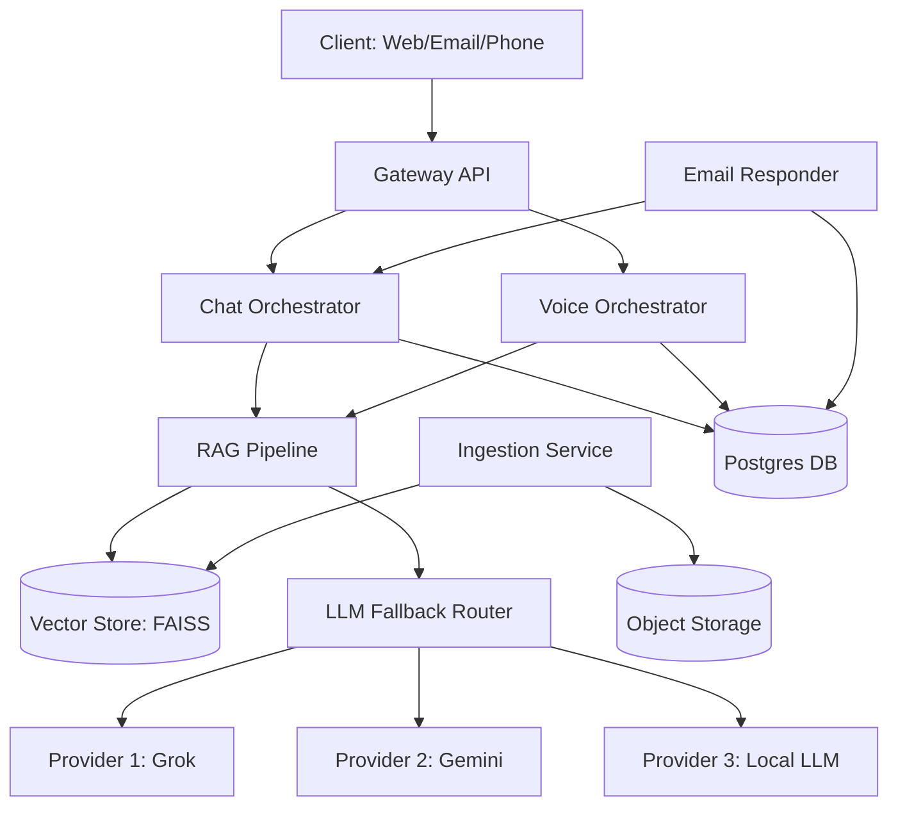

# High-Level Architecture

## 1. Overview
The system is designed as a microservices architecture to ensure scalability, maintainability, and resilience. It leverages a central RAG pipeline for consistent knowledge retrieval across all channels (Chat, Email, Voice).

## 2. Components

### 2.1. Services
1.  **gateway-api**:
    *   **Role**: Entry point for all external requests (Web Widget, Webhooks).
    *   **Tech**: Python (FastAPI) or Node.js (Express).
    *   **Responsibility**: Auth, Rate Limiting, Routing to orchestrators.

2.  **chat-orchestrator**:
    *   **Role**: Manages chat sessions and RAG flow.
    *   **Responsibility**:
        *   Receive user query.
        *   Call `ingestion-indexer` (retrieval).
        *   Call LLM Provider (via Fallback Router).
        *   Apply Guardrails.
        *   Format `AnswerEnvelope`.

3.  **email-responder**:
    *   **Role**: Background worker for email processing.
    *   **Responsibility**:
        *   Poll/Webhook for new emails.
        *   Classify intent.
        *   Generate draft using RAG.
        *   Store draft for agent review or auto-send.

4.  **voice-orchestrator**:
    *   **Role**: Handles voice interactions.
    *   **Responsibility**:
        *   Interface with Telephony Provider (Twilio/SIP).
        *   Manage ASR (Speech-to-Text) and TTS (Text-to-Speech).
        *   Execute IVR logic.

5.  **ingestion-indexer**:
    *   **Role**: Knowledge Base management.
    *   **Responsibility**:
        *   Parse uploaded documents.
        *   Chunk text.
        *   Generate Embeddings.
        *   Update Vector Store.
        *   Expose Retrieval API.

### 2.2. Data Stores
1.  **Postgres**:
    *   **Usage**: Structured data.
    *   **Tables**: Tickets, Sessions, Message Logs, Users, Configuration.

2.  **Vector Store (FAISS)**:
    *   **Usage**: Semantic search index.
    *   **Data**: Document embeddings + Metadata.

3.  **Object Storage**:
    *   **Usage**: Raw document storage (PDFs, etc.).

### 2.3. External Integrations
*   **LLM Providers**: Grok, Gemini, Cohere, Hugging Face, Local LLM.
*   **Telephony**: Twilio / Asterisk.
*   **Email**: IMAP / SMTP / MS Graph.

## 3. Data Flow (RAG Pipeline)

1.  **Query**: User sends query (Text or Voice->Text).
2.  **Retrieval**: `chat-orchestrator` queries `ingestion-indexer` / Vector Store.
3.  **Context**: Top-K relevant chunks are retrieved.
4.  **Generation**: Prompt constructed with Query + Context + Instructions.
5.  **Inference**: Sent to LLM Provider (with fallback logic).
6.  **Response**: LLM output parsed into `AnswerEnvelope` with citations.

## 4. Fallback Logic
*   **Primary**: Try Preferred Provider (e.g., Grok).
*   **Failure/Timeout**: Catch error -> Try Secondary (e.g., Gemini).
*   **...**: Continue down list.
*   **Ultimate Fallback**: If all LLMs fail, use deterministic rule-based answer from top retrieved chunk or generic "Service Unavailable" message.

## 5. Diagram (Mermaid)

